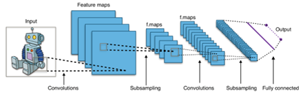
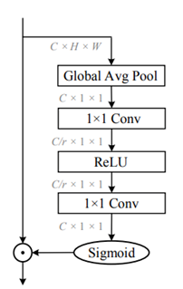

## CNN Combined with Attention Module for Facial Expression Recognition [Accepted at CONF-SEML 2023]

### Abstract
In contemporary times, the proliferation of information technology has prompted an increased interest among scholars towards artificial intelligence, particularly its constituent algorithms, such as deep learning, multilayer perceptron and convolutional neural networks. Of specific interest is the analysis of facial expressions, which has emerged as a popular research topic. However, classifying facial expressions presents a significant challenge due to variations 
in expressions associated with different emotions, as well as similarities between the various emotions. The task of expression classification is further complicated by the abundance of facial features that must be considered. In this paper, the basic Convolutional Neural Network (CNN) model was first trained on the FRE-2013 face expression dataset and optimized by adding an attention module to learn and analyse the key features of faces, thereby improving the classification accuracy of the model. In short, this model achieved an accuracy of 71.65% and an F1-Score of 0.66 while the model without the attention module only achieved a model accuracy of 69.86% and an F1-Score of 0.65, an improvement of about 2%. The analysis demonstrated that by adding the attention mechanism, some important features e.g. the eyes and mouth, are given more weight, thus improving the classification accuracy.
<p align="center">
      
</p>
<p align="center">
    <em>Figure 1: The architecture of the CNN.</em>
</p>

<p align="center">
      
</p>
<p align="center">
    <em> Figure 2: Squeeze Excitation (SE) Module </em>
</p>

### Catalogue Structure 
- The code folder contains the CNN module used in this experiment, I provide both the model with attention module and without attention module, which are completed by Tensorflow.
- As for the datasets, you could download the original data comes from https://www.kaggle.com/datasets/msambare/fer2013/code?datasetId=786787.

```
+-- code
|   +-- Model.py
|   +-- Model with Attention module.py
+-- CNN.png
+-- SE.png
+-- README.md
```
